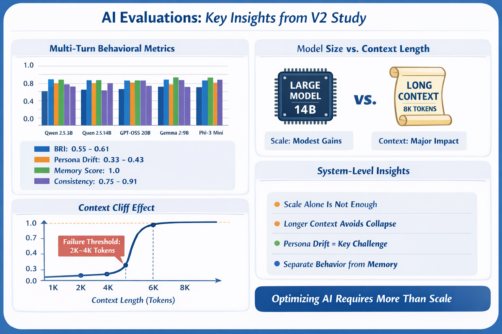

# AI Evals v2 --- Behavioral Reliability + Context Memory Cliff

## Intent and goals

AI Evals v2 is a local, reproducible evaluation harness for measuring
behavioral reliability of LLM systems over multi-turn interactions, with
a dedicated track that isolates context-window-driven memory collapse
("context cliff").

The goal is not to benchmark raw intelligence. The goal is to quantify
whether a model behaves like a reliable assistant when: - the
conversation spans multiple turns, - instructions must persist, -
persona/style constraints must hold, - the model must stay consistent, -
and memory must survive longer dialogues and/or limited context windows.

This repo is the v2 iteration of an earlier v1 system. v1 established
the execution and logging pipeline; v2 extends it into multi-turn
behavioral reliability and controlled experiment families.

**Project Overview:**

------------------------------------------------------------------------

## How we got here (v1 → v2)

### v1 foundation (execution + logging)

We started with a simple offline evaluation loop: 1. define prompts
(with expected constraints), 2. run local models (Ollama) with pinned
generation settings, 3. log raw responses per run, 4. compute
deterministic metrics, 5. aggregate and report.

This established the core scaffolding: runs, configs, and metrics
outputs.

### v2: scenario-first design

v2 begins by defining base scenario templates in
`data/v2_scenarios.jsonl`. These scenarios include: - a `scenario_id` -
tags (e.g., persona/memory/style/adversarial) - checks (what to evaluate
and how) - the multi-turn conversational script (system/user turns and
expected behavior)

### expanding the suite to 50 (generator → freeze)

To increase coverage without hand-authoring everything, we expanded base
scenarios into a larger suite using a generator/expander workflow: -
Base scenarios: `data/v2_scenarios.jsonl` - Expanded scenarios
(variants): `data/v2_scenarios_expanded.jsonl` - Frozen benchmark suite:
`data/v2_suite_50.jsonl`

`v2_suite_50.jsonl` is intentionally treated as a frozen snapshot so
results remain comparable over time. Future expansions should create a
new frozen suite (e.g., `v2_suite_50_v2.jsonl`) rather than overwriting
the original.

------------------------------------------------------------------------

## Experiments: why families exist and what each means

Once the behavioral suite was frozen, we added experiment families to
rerun the same suite under controlled variations, so we can attribute
differences to a single factor (context length, model size, etc.).

Experiments are defined in: - `configs/experiments.yaml`

Each family is a set of cells. A cell selects: - a profile (model +
runtime profile from `configs/run_config.yaml`) - optional overrides
(e.g., `num_ctx`) - the same frozen scenario suite
(`data/v2_suite_50.jsonl`)

### Family 1: context cliff (fixed model, sweep num_ctx)

Intent: show the reliability boundary where a single model's memory
fails as context shrinks.

Example cells: - Qwen 14B @ 1K / 2K / 4K / 6K / 8K context

This is a controlled context-only experiment: model remains fixed; only
`num_ctx` changes.

### Family 2: model size at fixed context (3B vs 20B)

Intent: separate model capability from context window capacity by
holding `num_ctx` constant (e.g., 2K) and comparing small vs large
models.

This answers: - when does more parameter count help, - when does it not
(because context is the bottleneck).

### Family 3: tradeoff (medium model long ctx vs larger model short ctx)

Intent: quantify the practical tradeoff most users face: - medium model
with longer context (better memory), - vs larger model with shorter
context (better reasoning but more forgetting).

### Optional: MoE comparison at fixed context

Intent: compare mixture-of-experts behavior to dense models at the same
context length.

### Behavioral baseline

Intent: a representative baseline across several models at a common
operating point (e.g., `num_ctx=2048`) to produce a stable comparison
view.

------------------------------------------------------------------------

## Why we forked out the ctx sweep (separate track)

We separated the true context boundary stress test into a dedicated
track because mixing it into the main behavioral suite causes two
problems:

1.  Different failure mode\
    Behavioral scenarios test "everyday" multi-turn correctness
    (persona, instruction persistence, consistency).\
    Context cliff scenarios intentionally push context eviction to force
    a memory collapse.

2.  Cleaner interpretation\
    If memory fails in a behavioral scenario, it's ambiguous whether the
    failure was caused by reasoning, instruction following, or context
    truncation.\
    The ctx cliff track isolates context-window mechanics by
    construction.

The ctx cliff suite is defined in: - `data/v2_ctx_cliff_suite_20.jsonl`

and run via: - `configs/experiments_ctx_cliff.yaml`

------------------------------------------------------------------------

## Running the system (high level)

### Run generation (experiments)

-   Behavioral suite + families:
    -   `python3 scripts/run_experiments.py --experiments configs/experiments.yaml`
-   Ctx cliff sweeps:
    -   `python3 scripts/run_experiments.py --experiments configs/experiments_ctx_cliff.yaml`

Runs are written as JSONL files under: - `results/v2/runs/`

Recommended separation for clarity: - `results/v2/runs/behavioral/` -
`results/v2/runs/ctx_cliff/`

------------------------------------------------------------------------

## Behavioral suite measurements and metrics

Behavioral scoring produces: -
`results/v2/metrics/behavioral/behavioral_metrics.csv` (scenario-run
rows) - `results/v2/metrics/behavioral/model_scorecard.json` -
`results/v2/metrics/behavioral/profile_scorecard.json` -
`results/v2/metrics/behavioral/model_profile_scorecard.json`

### What is scored

The behavioral suite is evaluated using deterministic checks defined per
scenario.

#### 1) Persona Stability Score (PSS)

Definition: fraction of persona-required turns where the response
satisfies persona markers/constraints (style, tone, format rules,
refusal behavior, "ask a question first," etc., depending on the
scenario).

Observed: persona performance is the most challenging component in our
baseline runs. Across the evaluated models, persona PSS clustered around
\~0.33--0.43.

#### 2) Instruction persistence / format score

Definition: whether formatting or structure constraints persist across
turns (e.g., required bullet counts, required JSON keys, "no direct
answer," etc.). This appears as `format_score` when the suite includes
format checks.

#### 3) Memory score (behavioral recall)

Definition: correctness on scenario-defined memory checks (e.g., named
entity recall, structured value recall) in standard-length dialogues.

Observed: behavioral memory checks in the frozen suite were
short-horizon and most models scored \~1.0. This is expected: the
discriminative memory stress test is handled in the ctx cliff track
(next section).

#### 4) Recovery score

Definition: whether the model acknowledges and corrects after an
explicit "you made an error" signal (apology + correction behavior),
when recovery checks are present.

#### 5) Consistency / contradiction rate

Definition: rate of detected contradictions across turns, converted to a
consistency score where applicable.

Observed: consistency scores in the baseline runs looked realistic and
varied by model, roughly in the \~0.75--0.91 range.

#### 6) Calibration

Definition: compare stated confidence (when required by scenario) vs
correctness to compute an average absolute error (AAE). Lower is better.

### Behavioral Reliability Index (BRI)

Definition: the mean of available behavioral components for a scenario
(only components that apply to that scenario are included). This avoids
penalizing scenarios that do not request calibration/recovery/etc.

Observed: BRI across the evaluated baseline models clustered around
\~0.55--0.61.

### Why enrichment exists

Memory compliance (MCS) scoring produces clean numeric outputs.
Enrichment joins those metrics with run metadata (from run JSONLs),
adding fields like: - `profile`, `model` - `cell_id`, `family` -
`temperature`, `num_ctx`, `num_predict` - `host` - `run_file`

This enables: - grouping by experiment family/cell, - plotting MCS vs
`num_ctx`, - comparing runs across models with consistent labels.

Enrichment outputs: -
`results/v2/metrics/behavioral/metrics_run_mcs_enriched.csv` -
`results/v2/metrics/ctx_cliff/metrics_run_mcs_enriched.csv`

------------------------------------------------------------------------

## Context sweep (ctx cliff) metrics and what we observed

Ctx cliff scoring focuses on Memory Compliance Score (MCS) and related
diagnostics.

Primary outputs: - `results/v2/metrics/ctx_cliff/metrics_turn_mcs.csv` -
`results/v2/metrics/ctx_cliff/metrics_run_mcs.csv` -
`results/v2/metrics/ctx_cliff/metrics_run_mcs_enriched.csv`

### Memory Compliance Score (MCS)

Definition: fraction of required memory checks that are satisfied across
turns (only turns marked as required in the scenario are evaluated).

### drop_turn_mean

Definition: the first required turn index where memory fails (averaged
across scenarios). This is the "where did the cliff happen?" number.

### mcs_auc

Definition: area under the MCS-by-turn curve. Captures prefix stability
(how long memory stays intact before degradation).

### Observed ctx cliff result (Qwen 14B)

In the ctx sweep, Qwen 14B showed a clean boundary between 2K and 4K
context:

-   `num_ctx=1024`: mcs ≈ 0.33, drop_turn_mean ≈ 7, mcs_auc ≈ 0.7
-   `num_ctx=2048`: mcs ≈ 0.33, drop_turn_mean ≈ 7, mcs_auc ≈ 0.7
-   `num_ctx=4096`: mcs = 1.0, mcs_auc = 1.0
-   `num_ctx=6144`: mcs = 1.0, mcs_auc = 1.0
-   `num_ctx=8192`: mcs = 1.0, mcs_auc = 1.0

This demonstrates a context-driven reliability cliff: multi-turn memory
behavior changes sharply once the context window can fully contain the
necessary dialogue history.

------------------------------------------------------------------------

## Plots: what they show and why they exist

Plots are generated by: - `scripts/plots/plot_v2_results.py` with
outputs in: - `artifacts/figures/`

Typical plot set: 1. MCS vs num_ctx (ctx cliff track)\
Shows the boundary where memory compliance collapses at smaller context
sizes.

2.  drop_turn_mean vs num_ctx\
    Shows how far a model gets before memory breaks under context
    pressure.

3.  mcs_auc vs num_ctx\
    Summarizes memory stability over time in a single number.

4.  (Optional) Behavioral comparisons by model/profile\
    If enabled, summarizes BRI components per model/profile.

------------------------------------------------------------------------

## Closing notes

This v2 system intentionally separates: - behavioral reliability (how
the model behaves in normal multi-turn use), from - context-window
mechanics (when memory collapses because earlier turns are evicted).

That separation makes conclusions defensible: - Behavioral scores
reflect instruction/consistency/persona behavior. - Ctx cliff metrics
isolate memory failure caused by limited context length.

If you iterate further, the recommended pattern is: - keep
`v2_suite_50.jsonl` frozen, - add new checks/scenarios to base +
expanded files, - cut a new frozen suite when you want a new benchmark
version.